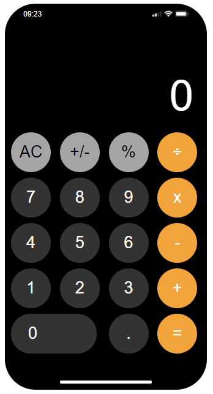

<h1>Calculadora do iPhone em HTML e CSS :iphone:</h1>

Mini projeto Web desenvolvido por um apaixonado em Front usando as tecnologia de HTML e CSS

##

<h1>Tecnologias usadas:</h1>

 
    
    

    <h1>Foto:</h1>
    </img>